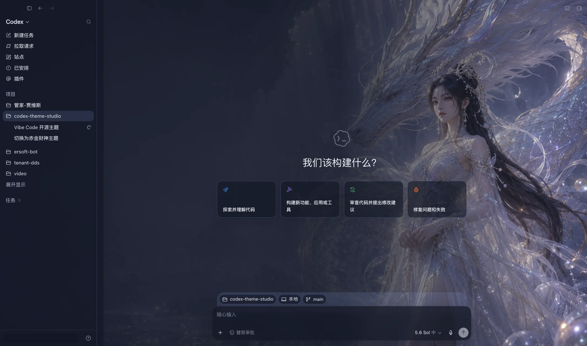
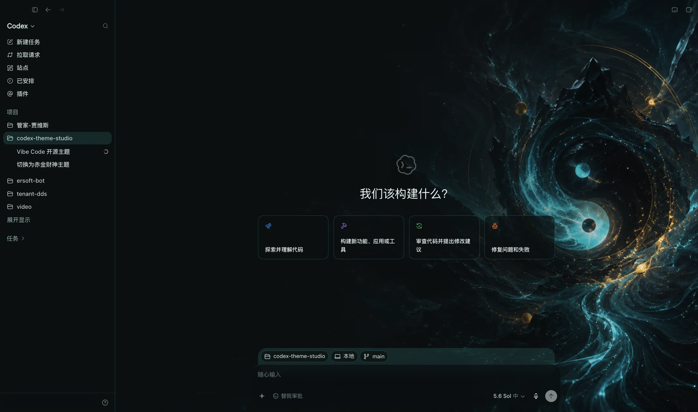
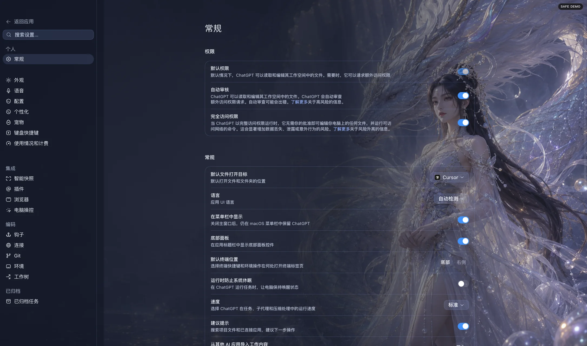
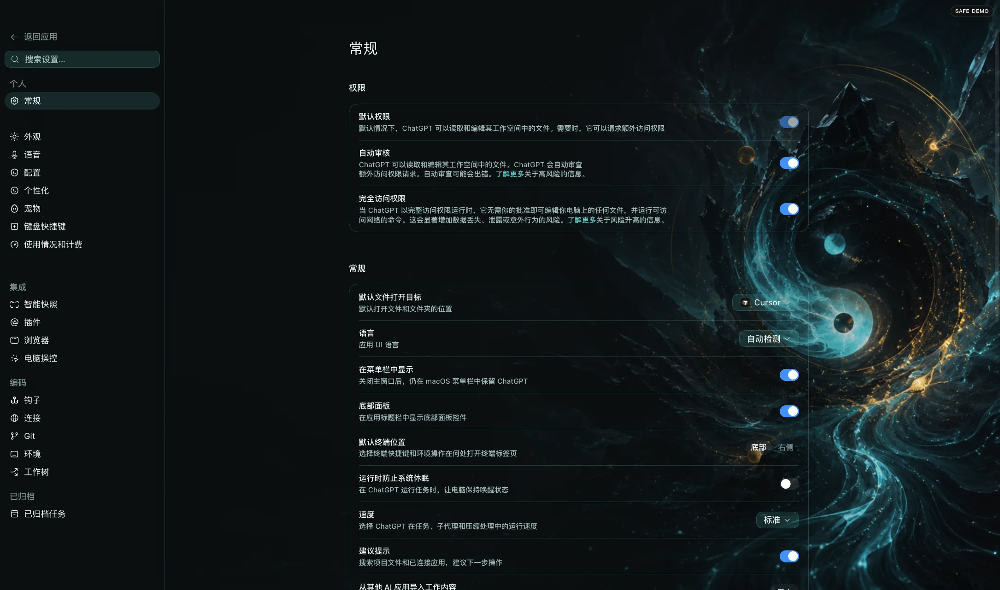

# Theme Studio for Codex

<p align="center">
  <a href="./README.md">简体中文</a> · <strong>English</strong>
</p>

> One image, a whole new atmosphere for Codex.

Theme Studio for Codex is an independently developed, open-source theme manager for the Codex workspace in the ChatGPT desktop app. It has no telemetry by default. Users install a **Plugin** that bundles a natural-language Skill, a deterministic CLI, the local runtime, and themes. Once installed, you can say “switch to Fortune Guardian,” “create a Nezha background,” or “restore the original appearance.”


## Real-world examples

These are real injection screenshots from the official ChatGPT desktop app, not concept mockups. Every theme includes a complete new-task view and Settings example. Only account identity is hidden; the project sidebar and app structure are not cropped.

| Wan Yao Codex · Longyuan Spirit (featured) | Taixu Qingxuan |
|---|---|
|  |  |
|  |  |

See [Real application examples](docs/REAL_EXAMPLES.md) for all 18 themes and 36 screenshots. The `preview-light.jpg` and `preview-dark.jpg` files inside each theme directory are design previews, not evidence of the real application appearance.

## Features

- Manage themes through natural language: install, import, preview, switch, inspect, and restore.
- Safe previews: a failed or timed-out validation automatically restores the previous appearance.
- Local operation: themes and state remain on your Mac, with no telemetry collected by default.
- No official-app modification: does not modify `ChatGPT.app`, legacy `Codex.app`, signatures, model configuration, or credentials.
- Eighteen built-in presets: six abstract environments, six original Eastern-inspired characters, and six “Wan Yao Codex” themes.
- Low-overhead design: metadata is separated from image decoding, observers coalesce updates, and hidden pages or reduced-motion environments are throttled.
- Migration-aware: recognizes the official Codex-to-ChatGPT transition and validates the running OpenAI-signed process.

## Requirements

- macOS 13 or later
- ChatGPT desktop app (legacy `Codex.app` is also supported)
- The initial release supports macOS only. Windows support is on the roadmap but is not available yet.

## Installation

For a first-time user, paste the following into a new Codex task that is allowed to run local commands and access GitHub:

```text
Install this theme plugin: https://github.com/ericsi-lab/codex-theme-studio
If its marketplace is not configured, add the main branch of
ericsi-lab/codex-theme-studio as a Codex Plugin Marketplace, then install
codex-theme-studio. Do not ask me to use Terminal. Ask before restarting ChatGPT,
then report installation status, launcher location, whether it is required, and
whether the featured default theme is active.
```

This is an agent-assisted flow in which Codex adds the Marketplace and installs the Plugin and local runtime. The GitHub URL itself does not grant silent-install permission, and enterprise policy or local approval settings may block the assisted installation. The deterministic installation entry point remains the Codex Plugins Directory or a configured Marketplace.

For manual installation, add this repository as a Marketplace in the Codex Plugins page, install **Theme Studio for Codex**, then start a new task and say “install themes.”

The Skill runs safety checks first. If Codex has not enabled a loopback-only debugging port, it provides explicit restart guidance. The process requires no administrator access and never relies on an opaque `curl | sh` command.

Installation reports the Plugin and runtime status, launcher location, whether the launcher is required, and the next step. A fresh installation also creates the optional `~/Applications/Theme Studio for Codex.app`. This is not a resident theme application; it only launches the official ChatGPT app safely in theme mode. The first successful activation applies **Wan Yao Codex · Longyuan Spirit** automatically. Later launcher opens preserve the user’s current choice and do not override an explicit restoration of the original appearance. The same consented restart can be performed from a Codex task, so the launcher and Terminal are not required.

When upgrading from an older release, the installer migrates `Codex Theme Studio.app` only if it carries this project’s management marker. An unrelated app with the same name is never overwritten or removed. User themes, images, and current configuration remain in the existing data directory.

First use validates the Bundle ID, OpenAI Team ID, Apple Developer ID certificate chain, and macOS dynamic validity of the running process. Static deep resource sealing is diagnostic only, so a transient false negative during an official app update does not block a new user. Users are not expected to reinstall the official app or run signing commands manually.

See the [English installation guide](docs/INSTALL.md) or [Chinese installation guide](docs/INSTALL.zh-CN.md) for details.

## Useful prompts

```text
Install themes
List available themes
Preview “Aurora Dome” for 30 seconds
Switch to “Fortune Guardian”
Switch to “Wan Yao Codex · Longyuan Spirit”
Create an Eastern deity theme with Nezha on the right
Create a theme from this local image
Check whether the current theme is healthy
Check compatibility after the latest app update
Restore the original Codex appearance
Uninstall the theme tool but keep my themes
```

Chinese theme names can also be used exactly as listed by the Plugin.

## Theme packages

A theme is a directory containing at least `theme.json` and one background image:

```text
my-theme/
├── theme.json
└── background.jpg
```

When image generation is available, the Skill generates the image first, then passes it to the local `import` command to validate it, extract colors and safe-area metadata, and preview it for 30 seconds by default. When generation is unavailable, the Skill asks for a local image. The Plugin stores no image-model API keys, and themes cannot contain JavaScript.

See [Theme format](docs/THEME_FORMAT.md) for the public schema, effects fields, path rules, and size limits. User themes live in `~/Library/Application Support/CodexThemeStudio/themes/` and survive upgrades.

“Wan Yao Codex” is a six-theme collection using artwork authorized by the project owner. Its featured default is `万妖图录·龙渊灵姬`. Installation alone does not change the interface; the theme is applied only after the user confirms the first theme-mode activation. An explicitly selected first theme takes priority. The featured default is applied only once and never overrides later choices or “restore the original appearance.”

## Compatibility identifiers

The public project name, Plugin display name, and launcher app name are all **Theme Studio for Codex**. To preserve lossless upgrades for existing installations, the internal package name `codex-theme-studio`, installation directory `~/.codex/codex-theme-studio/`, and data directory `~/Library/Application Support/CodexThemeStudio/` remain unchanged for now. These internal identifiers do not imply official affiliation.

## Security design

The runtime connects only to `127.0.0.1` and verifies the Codex app identity, running signature, process, CDP endpoint, and page markers. These checks prevent connection to an impersonating app or arbitrary browser page; they do not read task content. Decoration layers use `pointer-events: none`, so the sidebar, task content, and composer remain under Codex’s control. `restore` removes every injected element.

See [SECURITY.md](SECURITY.md), [PRIVACY.md](PRIVACY.md), and [Performance acceptance](docs/PERFORMANCE.md) for the complete boundaries.

## Development

```sh
npm test
npm run validate:themes
npm run benchmark:loader
npm run check:compatibility
npm run benchmark:app -- --confirmed --theme fortune-guardian --warmup 120 --seconds 600 --switches 30
```

`benchmark:app` temporarily restores and reapplies a theme, so it requires the explicit `--confirmed` flag. See [Upgrade compatibility](docs/UPGRADE_COMPATIBILITY.md) for desktop-app structure and security checks after an official update.

Plugin development updates use Codex’s official cachebuster/reinstall flow and should be verified in a new task. Read [CONTRIBUTING.md](CONTRIBUTING.md) before contributing.

See the [Roadmap](ROADMAP.md), [Contributing guide](CONTRIBUTING.md), and [Branching rules](docs/BRANCHING.md) for release plans and branch protection conventions.

## Roadmap

- `v0.1.x`: macOS hardware stability, real-world performance gates, and accessibility.
- `v0.2`: theme editor and visual safe-area controls.
- Future: Windows, after platform-specific safety validation is complete.

## Acknowledgements

During early research into cross-platform theme tools, this project reviewed the publicly demonstrated product ideas and platform-safety practices of community projects including [Codex Dream Skin](https://github.com/Fei-Away/Codex-Dream-Skin).

## Disclaimer and licenses

Unofficial project. Not affiliated with or endorsed by OpenAI. Codex and OpenAI are trademarks of their respective owners.

Source code is released under the [MIT License](LICENSE). Artwork licensing is documented in [ASSETS-LICENSE.md](ASSETS-LICENSE.md).
