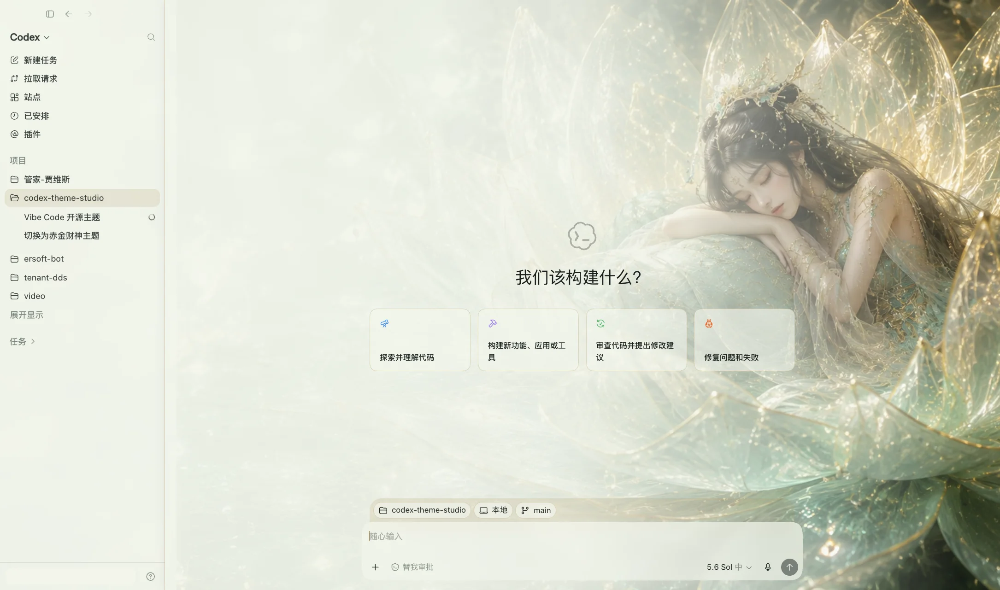
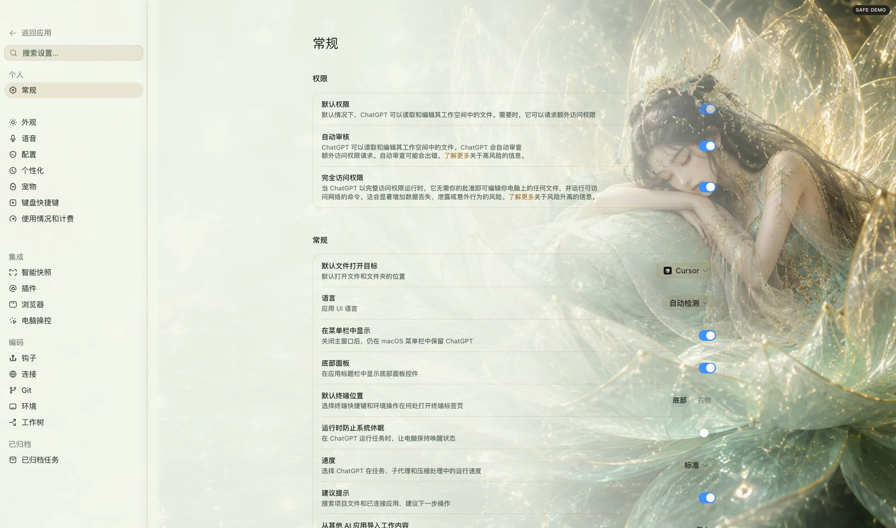

# Theme Studio for Codex

> 一张图，换一种 Codex 工作氛围。

Theme Studio for Codex 是一款自研、开源、默认无遥测的 ChatGPT 桌面端 Codex 工作区主题管理器。用户安装的是 **Plugin**；Plugin 内置自然语言 Skill、确定性 CLI、运行时和主题。安装后可以直接说“换成财神”“生成一个哪吒背景”或“恢复默认界面”。


## 真实效果

下面是官方 ChatGPT 桌面端中的真实注入截图，不是概念效果图。每套主题都提供完整的新建
任务页和设置页样例；截图只隐藏账户身份，项目侧栏和应用结构均未裁切。

| 万妖图录·龙渊灵姬（首推） | 万妖图录·琉璃莲梦 |
|---|---|
|  |  |
|  |  |

完整 18 套、36 张真实截图见 [真实应用效果](docs/REAL_EXAMPLES.md)。各主题目录里的
`preview-light.jpg` / `preview-dark.jpg` 是设计预览稿，不作为真实应用效果证明。

## 特点

- 自然语言管理主题：安装、导入、预览、切换、检查和恢复。
- 安全预览：验证失败或超时会自动恢复，不留下半成品界面。
- 本地运行：主题和状态只保存在本机，默认不收集遥测数据。
- 不修改官方安装包：不改动 `ChatGPT.app`、旧版 `Codex.app`、签名、模型配置或凭据。
- 十八套内置预设：六套抽象环境、六套原创东方角色和六套“万妖图录”主题。
- 低负载设计：元数据与图片解码分离、观察器合并更新、页面隐藏与减少动态效果时降频。
- 迁移感知：自动识别官方 Codex → ChatGPT 升级，并验证运行中的 OpenAI 签名进程。

## 系统要求

- macOS 13 或更高版本
- ChatGPT desktop app（同时兼容旧版 Codex.app）
- 首发版本仅支持 macOS。Windows 支持已列入路线图，但尚不可用。

## 安装

对第一次使用的人，最简单的方式是在 Codex 新任务中粘贴本仓库链接，并说：

```text
安装这个主题插件：https://github.com/ericsi-lab/codex-theme-studio
```

Codex 会读取仓库说明、安装 Plugin 和本地运行时，并在需要重启应用前请求确认。这是
Codex 代为执行的安装流程，不是浏览器链接本身具有静默安装权限。

也可以手动安装：在 Codex 的 Plugins 页面添加本仓库作为 Marketplace，安装
**Theme Studio for Codex**，然后在新任务中说“安装主题”。

Skill 会先运行安全检查。如果 Codex 没有开放仅本机可访问的调试端口，它会给出明确的重启指引；整个过程不需要管理员权限，也不会使用不透明的 `curl | sh`。

首次安装还会创建 `~/Applications/Theme Studio for Codex.app`。用户可以从该启动器进入主题
模式，也可以直接在对话里说“换成赤金财神”；如果 ChatGPT 是普通方式启动，Skill 会
先请求一次重启授权，再自动完成安全重启，不要求用户打开终端。

升级自旧版本时，只会迁移带有本项目管理标记的 `Codex Theme Studio.app`；同名但不属于
本项目的 App 不会被覆盖或删除。用户主题、图片和当前配置仍保存在原数据目录中。

首次使用会检查 Bundle ID、OpenAI Team ID、Apple Developer ID 证书链和运行中进程的
macOS 动态有效性。静态完整资源封签只作为诊断信号，不会再因为官方 App 更新过程中的
瞬时误报阻止新用户；用户不需要重装应用或手工运行签名命令。

详细说明见 [中文安装文档](docs/INSTALL.zh-CN.md) 和 [English installation guide](docs/INSTALL.md)。

## 常用说法

```text
安装主题
列出可用主题
预览“极光穹顶”30 秒
换成“赤金财神”
换成“万妖图录·龙渊灵姬”
生成一个东方仙神风、右侧是哪吒的背景
用这张本地图片生成主题
检查主题是否正常
检查当前版本升级后是否兼容
恢复 Codex 默认界面
卸载主题工具，但保留我的主题
```

## 主题包

一个主题就是一个目录，至少包含 `theme.json` 和一张背景图：

```text
my-theme/
├── theme.json
└── background.jpg
```

生成能力可用时，Skill 先生成图片，再交给本地 `import` 命令校验、提取配色与安全区，并默认预览 30 秒；能力不可用时会请用户提供本地图片。Plugin 不保存图像模型密钥，也不让主题携带 JavaScript。

公开 schema、特效字段、路径与尺寸限制见 [Theme format](docs/THEME_FORMAT.md)。用户主题位于 `~/Library/Application Support/CodexThemeStudio/themes/`，升级时不会被覆盖。

“万妖图录”是六套用户授权主题组成的系列，首推 `万妖图录·龙渊灵姬`。这里的“首推”
表示 README 和首次浏览时优先展示，不会在安装后静默换肤；正式应用仍由用户通过预览
或自然语言切换确认。

## 兼容标识

对外项目名、Plugin 显示名和 Launcher App 名统一为 **Theme Studio for Codex**。为保证
现有安装可以无损升级，内部包名 `codex-theme-studio`、安装目录
`~/.codex/codex-theme-studio/` 和数据目录
`~/Library/Application Support/CodexThemeStudio/` 暂时保持不变。这些内部标识不代表
官方归属。

## 安全设计

运行时仅连接 `127.0.0.1`，并检查 Codex 应用身份、运行中签名、进程、CDP 端点和页面标记。这个检查是为了避免连接到伪造应用或任意浏览器页面，不会读取任务正文。装饰层使用 `pointer-events: none`，侧栏、任务内容和输入框仍由 Codex 自身处理。`restore` 会移除全部注入内容。

完整边界见 [SECURITY.md](SECURITY.md)、[PRIVACY.md](PRIVACY.md) 和 [性能验收方法](docs/PERFORMANCE.md)。

## 开发

```sh
npm test
npm run validate:themes
npm run benchmark:loader
npm run check:compatibility
npm run benchmark:app -- --confirmed --theme fortune-guardian --warmup 120 --seconds 600 --switches 30
```

`benchmark:app` 会暂时恢复并重新应用主题，必须显式传入 `--confirmed`。桌面应用
升级后的结构与安全检查见 [Upgrade compatibility](docs/UPGRADE_COMPATIBILITY.md)。

插件开发更新使用 Codex 官方 cachebuster/reinstall 流程，并在新任务中验证 Skill。贡献前请阅读 [CONTRIBUTING.md](CONTRIBUTING.md)。

版本计划见 [Roadmap](ROADMAP.md)，贡献流程和分支权限约定见
[Contributing](CONTRIBUTING.md) 与 [Branching rules](docs/BRANCHING.md)。

## 路线图

- `v0.1.x`：macOS 实机稳定性、真实性能门禁、无障碍适配。
- `v0.2`：主题编辑器与可视化安全区。
- Future：Windows（完成安全验证后发布）。

## 致谢

本项目在跨平台主题工具的早期调研中，参考了
[Codex Dream Skin](https://github.com/Fei-Away/Codex-Dream-Skin) 等社区项目公开展示的
产品思路与平台安全实践。

## 声明

Unofficial project. Not affiliated with or endorsed by OpenAI. Codex and OpenAI are trademarks of their respective owners.

代码按 [MIT License](LICENSE) 发布；图片素材授权见 [ASSETS-LICENSE.md](ASSETS-LICENSE.md)。
